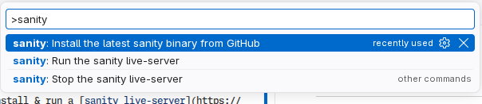
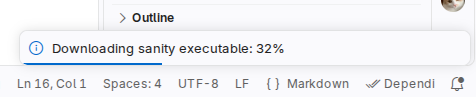
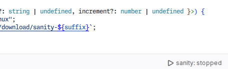
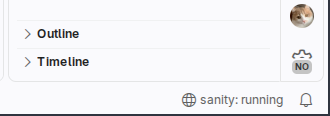
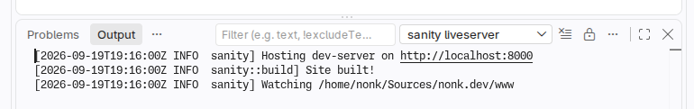

# sanity liveserver for Visual Studio Code

A VS Code extension to install & run a [sanity liveserver](https://github.com/nonk123/sanity) for supported projects.

Install from [the Visual Studio Marketplace](https://marketplace.visualstudio.com/items?itemName=nonk123.vscode-sanity-liveserver) and [the Open VSX Registry](https://open-vsx.org/extension/nonk123/vscode-sanity-liveserver).

## Screenies

### Commands (Ctrl+Shift+P)

### Status-bar button

### Logs

